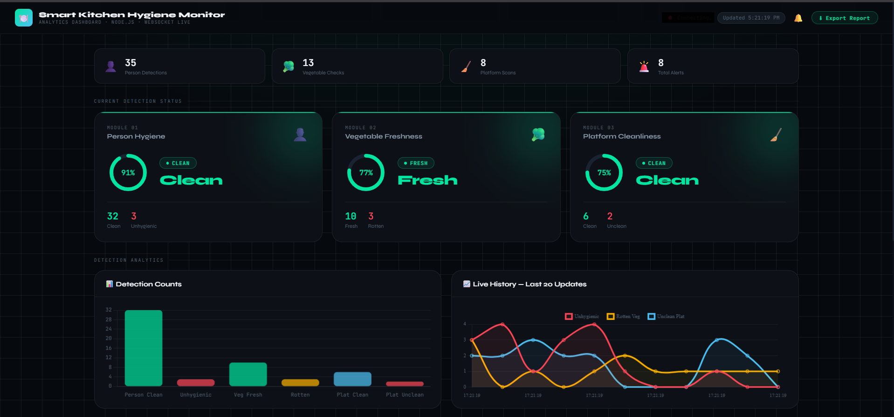

# 🍽️ Smart Kitchen Hygiene Monitoring System

An kitchen hygiene monitoring system designed to improve cleanliness, food safety, and kitchen environment monitoring using Computer Vision, Machine Learning, and IoT sensors.

---

# 🚀 Project Detects

- 🥦 Vegetable Freshness / Hygiene
- 👨‍🍳 Person Cleanliness
- 🧽 Kitchen Platform Cleanliness
- 🌡️ Temperature & Humidity
- 💨 Air Quality & Gas Leakage

---

# ✨ Features

- ✅ Real-time hygiene monitoring using AI
- ✅ YOLO-based object & hygiene detection
- ✅ Live webcam monitoring
- ✅ Dashboard visualization using Flask
- ✅ Environmental monitoring using sensors
- ✅ Alert system for unsafe conditions
- ✅ Evidence image capture system
- ✅ Modern web dashboard UI

---

# 🛠️ Technologies Used

## AI / Machine Learning
- Python
- OpenCV
- YOLO
- TensorFlow
- Teachable Machine

## Web & Dashboard
- Flask
- HTML
- CSS
- JavaScript

## Hardware & IoT
- Arduino UNO
- DHT22 Sensor
- MQ2 Gas Sensor
- MQ135 Air Quality Sensor

# Smart Kitchen Hygiene System

## ⚙️ How It Works

### 1️⃣ AI-Based Detection
The system uses webcam input to detect:
*   Hygienic / Unhygienic person
*   Clean / Dirty kitchen platform
*   Fresh / Unfresh vegetables

### 2️⃣ Sensor Monitoring
Sensors continuously monitor:
*   Temperature
*   Humidity
*   Gas Leakage
*   Air Quality

### 3️⃣ Dashboard
A Flask dashboard displays:
*   Live camera feed
*   Sensor values
*   Hygiene status
*   Alerts & evidence

### 4️⃣ Alert System
If unsafe conditions are detected:
*   Alerts are generated
*   Evidence images are stored

---

## 📸 Dashboard Preview

  

---

## 📊 Future Improvements

- 📱 Mobile App Integration
- ☁️ Cloud Database Support
- 📷 Multi-Camera Monitoring

---

## 🎯 Applications

- Restaurants
- Smart Kitchens
- Food Industry
- Hotel Kitchens
- Hygiene Inspection Systems

This project is developed for educational and research purposes.
